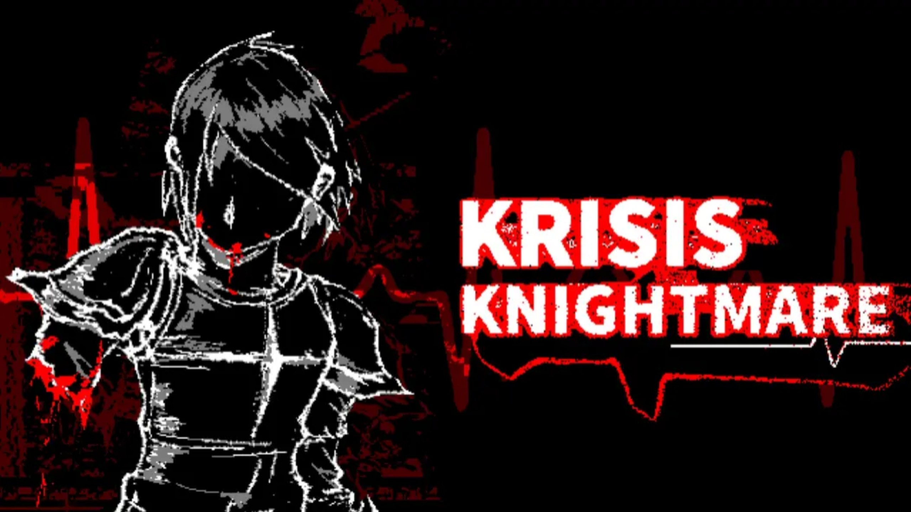

# KRISIS KNIGHTMARE

[](LICENSE-APACHE)



**KRISIS KNIGHTMARE** — the authorized gamification project of the animation [KRISIS KNIGHTMARE](https://www.bilibili.com/video/BV1r7f1ByETC), built with the [Kristal](https://github.com/KristalTeam/Kristal).

| English | 简体中文 |
|---------|---------|
| English | [简体中文](./README.md) |

## Introduction

This project is a fan-game adaptation of the Bilibili animation [KRISIS KNIGHTMARE](https://www.bilibili.com/video/BV1r7f1ByETC), released as open source with full authorization.

*You can also watch the English version of this animation on [YouTube](https://www.youtube.com/watch?v=GOfVuCJ4BG8).*

## Download and Run

This project is distributed both as a Kristal project package (mod form) and as standalone builds. [GitHub Releases](https://github.com/Bli-AIk/krisis_knightmare/releases), GameBanana, and Gamejolt are all **official distribution sources** for this game. GitHub Releases is currently available; the GameBanana and Gamejolt pages are being prepared and will be available soon.

- **Kristal project package (mod form, experimental)**: Download `krisis-knightmare-mod.zip` from a release, install Kristal `v0.10.0`, place the ZIP directly in the projects folder opened from Kristal's main menu (the source version uses the `mods/` directory), and select `krisis_knightmare` from the project list. Do not wrap the ZIP in another outer folder.
- **Standalone**: Windows users can download `*-win64.zip`, extract it, and run the game directly. Other platforms may use the `.love` file with the appropriate LÖVE runtime.

Running the project on its own as a Kristal project package has not been fully verified, although it should be theoretically possible based on the project structure and development workflow.

<details>
<summary>About the mod workflow and development environment</summary>

This project was itself developed as a Kristal project: during development, it was run from Kristal's `mods/` directory, with the game's logic and assets kept in this repository. The mod ZIP is a project package and does not include the modified Kristal engine used by standalone builds.

To create standalone builds, the build scripts copy Kristal into a temporary build directory and apply a small set of changes only to that copy. These changes are not written to the Kristal source repository and are not included in the mod ZIP. They mainly:

- set the target project, automatic project startup, window title, and window identity;
- remove the engine's default frame-rate cap;
- display a `made with` credit on the startup screen;
- skip the startup animation when a finisher resume record is detected;
- allow the HTTPS native library embedded in a `.love` archive to be extracted to the save directory before loading;
- disable Kristal DebugSystem input hooks in release builds;
- support external `mod.json` overrides in debug builds and adjust mod development settings per build type.

As a result, whether the mod form works completely in an unmodified Kristal environment still requires actual testing; it should not yet be treated as a verified standalone player version.
</details>

## Credits

### Original Animation

| Role | Name |
|------|------|
| DELTARUNE Author | TOBY FOX |
| Lead Production | UJB传说官方 |
| Bullet Hell Design | 滑稽体验镇魂曲 |

| Role | Name |
|------|------|
| Design | Nahisa图文 |
| Script | 这里不是红耀西 |
| Sound | 5P4mt0n |

| Chapter | Author |
|---------|--------|
| -FINAL PROPHECY- | \_B0TtLE\_ (Bilibili) |
| -NEVER FORGETTING- | Local, H00ligan, The Joker |
| -DARK OUTSKIRTS- | Vision Crew's Deltarune |
| -REBIRTH- | Chirou-P (Bilibili) |

| Role | Name |
|------|------|
| Cover Art | GFM |
| Trailer | GA |
| Design | Waga_Love |

| Special Thanks |
|----------------|
| Aug_ust八月 |
| Alivall\_ |
| Saarasin |
| 青柠不是人 |

| Special Thanks |
|----------------|
| 飞上天的开心果 |
| GoodTeaIce |
| Xx_FrekGT_xX |
| Rock |

### Game Development

| Role | Name |
|------|------|
| Game Developer | Bli_AIk |
| Game Testing | church\_wafer, Nahisa图文, 滑稽体验镇魂曲, Gpie\_A, Anskiyy |
| Engine | [Kristal](https://github.com/KristalTeam/Kristal) |

## Run from Source

The following steps are for developers running the project from source, not for installing the release mod ZIP.

1. Install Kristal `v0.10.0` from the [Kristal](https://github.com/KristalTeam/Kristal) project.
2. Clone this repository into Kristal's `mods/` directory:

   ```bash
   cd Kristal/mods
   git clone https://github.com/Bli-AIk/krisis_knightmare.git
   ```

3. Launch Kristal and select **krisis_knightmare** from the mod menu.

## Debug CLI

This mod enables the `terminal-cli` library. Run `just run` in the current terminal,
or use `just term` to launch a separate terminal. The terminal and the game window
share the same Kristal debug console.

Enter Lua expressions or statements in the terminal to inspect and change the live
game state, for example:

```text
=Game.world.player.x
Game.world.player:setPosition(160, 120)
```

Terminal commands are added to the in-game console history, and commands entered in
the game GUI are echoed back to the terminal. The library is enabled only in dev mode
by default; disable it or change `max_commands_per_frame` in the `terminal-cli` section
of `mod.json` as needed.

## Contributing

Issues and Pull Requests are welcome.

## License

This project is licensed under either of

- Apache License, Version 2.0 ([LICENSE-APACHE](LICENSE-APACHE) or http://www.apache.org/licenses/LICENSE-2.0)
- MIT license ([LICENSE-MIT](LICENSE-MIT) or http://opensource.org/licenses/MIT)

at your option.
